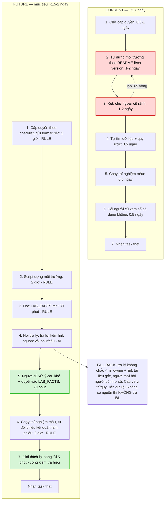

# 02 — Group Problem Statement (Bản nộp nhóm)

> Làm chung 1 bản, mỗi thành viên copy vào repo cá nhân. Đi theo Phase 3 → 6 trong `01-worksheet.md`. Nhóm chỉ chọn **candidate problem** ở Phase 3, viết Problem Statement sau khi validate + vẽ workflow.

> **Về số liệu trong bài:** bảng giả định ở mục 4.1 ghi rõ từng con số đang ở trạng thái nào — đã đếm, đã hỏi, hay còn là ước lượng. Hai số chưa chốt được trong thời lượng lab (giờ công người cũ, tỉ lệ câu hỏi checklist giải được) đều nói rõ cần bao lâu mới đo xong, và cả hai đã được đưa thành cổng đo trong quyết định ở Phase 6.3.

## Thành viên nhóm

| STT | Họ và tên        | Mã học viên       | Vai trò trong nhóm                                                 |
| --- | ---------------- | ----------------- | ------------------------------------------------------------------ |
| 1   | Nguyễn Sơn Giang | 2A202602747 (K4A) | Facilitator + workflow owner (chủ bài được chọn)                   |
| 2   | Vũ Thường Tín    | 2A202602955       | Research + evidence (secondary sources, tool landscape)            |
| 3   | Đặng Hữu Tâm     | 2A202602940       | Challenge lead (người hỏi khó, giữ nhóm khỏi solution-first)       |
| 4   | Nguyễn Anh Dũng  | 2A202602554       | Validation (interview + đếm log)                                   |
| 5   | Lê Tuấn Anh      | 2A202602952       | Writer + metric owner (giữ metric đo được)                         |
| 6   | Hoàng Anh Tài    | 2A202602612       | Domain check (đối chiếu bài toán với bối cảnh doanh nghiệp / data) |

**Candidate problem nhóm chọn (1 câu):**

Người mới vào một nhóm kỹ thuật (lab nghiên cứu, team dự án, công ty nhỏ) mất khoảng **5,7 ngày làm việc** (đã hỏi 3 người mới: 4 / 6 / 7 ngày) mới chạy được task thật đầu tiên — không phải vì việc khó, mà vì kiến thức setup và quy ước làm việc nằm trong đầu người cũ chứ chưa bao giờ được ghi lại ở nơi tra được, nên mỗi đợt nhận người lại phải trả lời lại từ đầu.

---

## Phase 3 — Group Convergence: từ 18 candidates về 1

> Nhóm có 6 người × 3 Problem Card = **18 candidates** (nhiều hơn hẳn mức 9-12 của worksheet). Nhóm không vote ngay mà đi đủ 4 bước: trình bày → cluster → shortlist → score.

### 3.1. Trình bày top 3 mỗi người (mỗi candidate 1-2 phút)

| #   | Người đưa ra | Candidate problem                                                            | Người gặp vấn đề                                            | Điểm nghẽn                                                                                        | Cảm nhận nhanh của nhóm                                                                                                      |
| --- | ------------ | ---------------------------------------------------------------------------- | ----------------------------------------------------------- | ------------------------------------------------------------------------------------------------- | ---------------------------------------------------------------------------------------------------------------------------- |
| 1   | Giang        | Onboarding thành viên mới vào lab                                            | SV mới join lab (2-4 người/kỳ) + thành viên cũ nắm codebase | Bước 2-3: tự dựng môi trường theo README lệch version, kẹt thì phải chờ người cũ rảnh mới trả lời | Mạnh nhất: hai actor cùng đau, metric bấm được bằng đồng hồ                                                                  |
| 2   | Giang        | Paper share vào channel `journalclub` chỉ có link, không ai biết có đáng đọc | Người share + cả lab đọc channel                            | Chi phí để biết "bài này có liên quan tới tôi không" ≈ chi phí đọc luôn bài đó                    | Rất "AI-shaped", nhưng metric phụ thuộc hành vi tự nguyện, khó chắc                                                          |
| 3   | Giang        | Feedback bản thảo đến từ 4 kênh, không nơi nào ghi trạng thái                | Tác giả chính + supervisor + co-author                      | Bước gom feedback từ 4 nơi; feedback nói miệng không để lại dấu vết nào                           | Metric sắc nhất nhóm (đếm số ý bỏ sót), nhưng chính người pitch kết luận là process fix                                      |
| 4   | Tín          | Onboarding information bị phân tán trong doanh nghiệp                        | Intern / fresher / new hire + mentor, HR, IT                | "Bước tiếp theo là gì" và "ai là đúng người để hỏi"                                               | Trùng pattern với #1 nhưng ở bối cảnh doanh nghiệp, có secondary evidence mạnh → gộp                                         |
| 5   | Tín          | Meeting không chuyển thành accountable task                                  | Project member + team leader + CLB organizer                | Từ quyết định nói miệng sang một task có owner/deadline track được                                | Phổ biến, nhưng một meeting template 2 phút có thể giải gần hết → dễ thành bài Rule thuần                                    |
| 6   | Tín          | Khó tìm lại thông tin nằm rải trong nhiều công cụ                            | Intern / project member / knowledge worker                  | Người nhớ ngữ nghĩa, hệ thống lại đòi đúng keyword hoặc đúng vị trí                               | Scope dễ phình thành "enterprise search", quá rộng cho lab 4 tiếng                                                           |
| 7   | Tâm          | Tìm lại tài liệu cũ rải ở Zalo / ổ đĩa / web                                 | Bản thân + vài bạn học cùng                                 | Bước tìm thủ công vì không có cấu trúc lưu trữ, không nhớ tên file                                | Actor hẹp (chủ yếu một người), khó validate với người ngoài                                                                  |
| 8   | Tâm          | AI không nhớ ngữ cảnh giữa các phiên chat khi học một chủ đề dài             | Người tự học bằng AI                                        | Phải gõ lại tóm tắt ngữ cảnh 15-30 phút mỗi lần mở chat mới                                       | Thú vị nhưng lời giải phụ thuộc sản phẩm bên thứ ba, nhóm không kiểm soát được                                               |
| 9   | Tâm          | Họp đồ án đã ghi "ai làm gì" nhưng vẫn bị hỏi lại                            | Cả nhóm đồ án 3-5 người                                     | Ghi chú trôi lẫn trong đoạn chat thường ngày, không ở chỗ cố định                                 | Chính người pitch tự đánh giá impact ở mức nhẹ                                                                               |
| 10  | Dũng         | Preflight kiểm bài trước khi nộp lab                                         | Thành viên được giao tổng hợp + nộp deliverable             | Đối chiếu rubric với file thật: 12 trong tổng 22 phút                                             | Baseline đẹp nhất (đã bấm giờ), nhưng vòng đời ngắn theo từng môn                                                            |
| 11  | Dũng         | Tìm lại quyết định và nguồn thông tin của nhóm                               | Thành viên làm task sau hoặc vắng buổi thảo luận            | Search rồi tự ghép context từ Discord + Drive + GitHub, 11 phút/lượt                              | Trùng #6 và #7 → gộp thành một cluster                                                                                       |
| 12  | Dũng         | Feedback review không được tách thành việc cần sửa cụ thể                    | Người nhận feedback + reviewer                              | Tự diễn giải comment thành việc cần làm, 10 phút/artifact                                         | Trùng #3 và #5                                                                                                               |
| 13  | Tuấn Anh     | Feedback user rời rạc → quyết định ưu tiên release cảm tính                  | Indie dev + user đã gửi feedback                            | Gom + phân loại thủ công 1-2 giờ/tuần từ 3-4 kênh                                                 | Boundary rất đẹp (AI gợi ý, người chốt), nhưng chỉ 1/6 thành viên hiểu domain                                                |
| 14  | Tuấn Anh     | Việc chờ 2-3 tuần bị quên follow-up                                          | Tech lead + bên cung cấp kết quả + team hạ nguồn            | Không có cơ chế nhắc theo mốc thời gian cho việc "đang chờ"                                       | Chính người pitch kết luận Rule là đủ → không có gì để so sánh R/W/A                                                         |
| 15  | Tuấn Anh     | Sinh viên hỏi lại cùng một câu (deadline, cách nộp, cách chấm)               | Giảng viên + SV hỏi + SV ngại hỏi (thiệt ngầm)              | Không có nguồn tự phục vụ tập trung, ~60% câu là trùng lặp                                        | Cùng pattern với #1: câu trả lời tồn tại nhưng chưa ai ghi lại ở chỗ tra được                                                |
| 16  | Tài          | Viết meeting minutes sau mỗi buổi họp                                        | Người được phân công ghi biên bản                           | Vừa nghe họp vừa ghi chú, rồi tổng hợp lại sau buổi họp: ~60 phút/buổi, ~1 giờ/tuần               | Metric rõ (60 → ≤15 phút + giữ đủ action item), nhưng nội dung họp nhạy cảm và AI dễ bịa phần nghe không rõ                  |
| 17  | Tài          | Tìm và hiểu definition của các chỉ tiêu dữ liệu trước khi dùng               | Data Analyst / Data Intern                                  | Đối chiếu definition từ nhiều nguồn: 20-30 phút mỗi chỉ tiêu chưa quen                            | Cùng pattern cluster A (câu trả lời tồn tại nhưng chưa ai ghi ở chỗ tra được), nhưng vướng quyền truy cập và an toàn dữ liệu |
| 18  | Tài          | Xếp lịch họp thỏa mãn lịch trống của nhiều người                             | Người tổ chức họp + các thành viên                          | Tìm khoảng thời gian thỏa nhiều ràng buộc: 10-20 phút/lần, nhiều tin nhắn qua lại                 | Chính người pitch tự đặt câu hỏi liệu chỉ cần calendar + rule có đủ chưa → nhiều khả năng là bài Rule, không cần AI          |

### 3.2. Gom trùng / cluster (18 ý → 4 cụm)

| Cluster                                    | Candidates included            | Pattern chung                                                                                                                                            | Ghi chú                                                                                                                                                                                            |
| ------------------------------------------ | ------------------------------ | -------------------------------------------------------------------------------------------------------------------------------------------------------- | -------------------------------------------------------------------------------------------------------------------------------------------------------------------------------------------------- |
| **A. Kiến thức ngầm & người mới**          | #1, #4, #15, #17               | Câu trả lời **đã tồn tại trong đầu người cũ nhưng chưa bao giờ được ghi lại**. Mỗi người mới lại hỏi lại từ đầu, và chi phí rơi đúng lên người bận nhất. | 4/6 thành viên độc lập nghĩ ra, ở 4 bối cảnh khác nhau (lab nghiên cứu, doanh nghiệp, lớp học, đội ngũ dữ liệu). Đây là tín hiệu pattern thật chứ không phải trùng ngẫu nhiên.                     |
| **B. Đã ghi nhưng không tìm lại được**     | #6, #7, #8, #11                | Nội dung **đã được ghi ở đâu đó** nhưng phân mảnh qua nhiều app, không có cấu trúc/tag → chi phí nằm ở khâu tìm lại, không phải khâu tạo ra.             | Nhóm tách A và B ra thay vì gộp. Phân biệt này quyết định giải pháp: **A phải viết ra trước mới có gì để tìm; B mới thật sự là bài search.** Nếu gộp nhầm, nhóm sẽ đi xây search cho một kho rỗng. |
| **C. Việc & feedback không có trạng thái** | #3, #5, #9, #12, #14, #16, #18 | Thông tin đi qua kênh không lưu trạng thái (chat, nói miệng) → không ai biết ý nào đã xử lý, việc nào còn treo.                                          | Cụm đông nhất (7/18) nhưng cũng là cụm mà **3/6 người pitch tự kết luận không cần AI**. Nguyên nhân gốc là thói quen ghi chép, không phải năng lực tổng hợp.                                       |
| **D. Triage & tổng hợp để ra quyết định**  | #2, #10, #13                   | Có nhiều input thô, người phải đọc hết mới quyết định được; AI có thể làm **rẻ đi bước "cái này có đáng làm/đáng đọc không"**.                           | Đúng thế mạnh của mô hình ngôn ngữ, nhưng metric của cả 3 bài đều phụ thuộc hành vi tự nguyện của người khác → khó chứng minh trong 4 tiếng.                                                       |

### 3.3. Shortlist (giữ 3 bài trả lời được 7 câu hỏi worksheet)

Nhóm gộp các candidate trùng trong cùng cluster thành **một bài chung** trước khi shortlist, để không chấm điểm cùng một pattern ba lần.

| Candidate (đã gộp)                                                        | Vì sao vào shortlist                                                                                                                                                                                                                                                                                                            | Rủi ro / điều chưa rõ                                                                                                                                                                                                                                                                                                             |
| ------------------------------------------------------------------------- | ------------------------------------------------------------------------------------------------------------------------------------------------------------------------------------------------------------------------------------------------------------------------------------------------------------------------------- | --------------------------------------------------------------------------------------------------------------------------------------------------------------------------------------------------------------------------------------------------------------------------------------------------------------------------------- |
| **S1 — Onboarding người mới vào nhóm kỹ thuật** (gộp #1 + #4 + #15 + #17) | (a) Hai actor cùng đau và đau theo hai kiểu khác nhau: người mới bị chặn, người cũ bị cắt vụn thời gian. (b) Workflow vẽ được 7 bước, nghẽn dồn vào 2 bước dính nhau. (c) Metric bấm bằng đồng hồ và đếm được (số ngày tới thí nghiệm đầu tiên, số câu hỏi lặp). (d) 4/6 thành viên đã sống qua bài này ở 4 bối cảnh khác nhau. | Chưa rõ **bao nhiêu phần trăm câu hỏi giải được chỉ bằng checklist tĩnh**. Nếu con số đó cao, bài này dừng ở Rule và phần cho AI gần như biến mất. Đây là rủi ro lớn nhất và nhóm biến nó thành cổng đo ở Phase 6.                                                                                                                |
| **S2 — Tìm lại quyết định & tài liệu của nhóm** (gộp #6 + #7 + #11)       | (a) Pain lặp lại, đo được bằng time-to-find (11 phút/lượt theo số của Dũng). (b) Đi qua nhiều nguồn nên thấy rõ chi phí context-switching. (c) So sánh Rule (decision log + tag) với Workflow (retrieval có trích nguồn) khá rõ.                                                                                                | Nguyên nhân gốc có thể là **quyết định vốn không được ghi đủ rõ**, tức lại quay về cluster A. Scope cũng rất dễ phình thành enterprise search. Actor "knowledge worker" còn chung chung. Nhóm để #8 (AI không nhớ ngữ cảnh giữa các phiên chat) ra ngoài S2 vì lời giải nằm trong sản phẩm bên thứ ba, nhóm không kiểm soát được. |
| **S3 — Feedback & action item không có trạng thái** (gộp #3 + #5 + #12)   | (a) Metric sắc nhất: đếm số ý feedback bị bỏ sót mỗi vòng, không cần ước lượng. (b) 6/6 thành viên đều có ít nhất một candidate thuộc cụm này. (c) Workflow 5 bước rõ, nghẽn ở đúng một bước (gom feedback).                                                                                                                    | **Ba người pitch trong cụm này — #3, #14 và #18 — đều tự kết luận là process fix.** Nguyên nhân gốc là feedback nói miệng không để lại dấu vết — không có input thì AI không có gì để tổng hợp. Chọn bài này thì phần "so sánh Rule/Workflow/Agent" gần như không có gì để so.                                                    |

**Bảy câu hỏi worksheet — nhóm trả lời cho S1 (bài được chọn):**

| Câu hỏi                                           | Trả lời                                                                                                                                                                                                                                                                                                                                                                           |
| ------------------------------------------------- | --------------------------------------------------------------------------------------------------------------------------------------------------------------------------------------------------------------------------------------------------------------------------------------------------------------------------------------------------------------------------------- |
| Có ai trong nhóm hiểu workflow thật đủ sâu không? | Có. Giang đang ở trong lab và đã trải qua 2 đợt nhận thành viên mới; Tín đã đi thực tập doanh nghiệp; Tuấn Anh đang là người phải giải thích kiến trúc cho member mới ở công ty ~10 người; Tài gặp đúng pattern này ở đội ngũ dữ liệu khi phải đi tìm definition của chỉ tiêu. Bốn góc nhìn: người mới, người cũ, người quản lý, và người phải dùng lại thành quả của người khác. |
| Actor có cụ thể không?                            | Có, và là **hai** actor: (1) người mới join một nhóm kỹ thuật có codebase + quy ước riêng; (2) thành viên cũ nắm codebase nhất — cũng là người bận nhất — phải trả lời họ.                                                                                                                                                                                                        |
| Bottleneck có phải một bước cụ thể không?         | Hai bước dính nhau: tự dựng môi trường theo tài liệu lệch version, và chờ người cũ rảnh mới được trả lời. Nhóm coi đây là một điểm nghẽn vì bước 3 chỉ tồn tại do bước 2 thất bại.                                                                                                                                                                                                |
| Impact có thể đo được không?                      | Có: số ngày từ lúc cấp quyền đến lúc chạy xong thí nghiệm mẫu; số câu hỏi lặp mỗi người mới; số giờ công người cũ mất mỗi đợt.                                                                                                                                                                                                                                                    |
| Có thể vẽ before/after workflow không?            | Có, xem 5.1 và 5.2.                                                                                                                                                                                                                                                                                                                                                               |
| Có thể so sánh Rule / Workflow / Agent không?     | Có, và đây là điểm mạnh nhất: có một lớp chắc chắn là Rule (script + checklist) và một lớp chỉ Workflow mới phủ được (câu hỏi ngữ cảnh). Ranh giới giữa hai lớp là thứ nhóm đo được.                                                                                                                                                                                              |
| Có quá rộng cho lab hôm nay không?                | Không, nếu thu hẹp actor về "người mới vào **một** nhóm kỹ thuật cụ thể". Nhóm đã bác một đề xuất mở rộng thành "trợ lý onboarding cho toàn trường" vì mỗi lab/team có quy ước riêng, trợ lý chung sẽ không trả lời đúng cho nơi nào cả.                                                                                                                                          |

### 3.4. Score để đồng thuận (chấm 1-5)

| Candidate                                     | Actor rõ | Workflow rõ | Pain có evidence | Impact đo được | Làm trong lab | So sánh R/W/A được | Nhóm hiểu domain |   Tổng |
| --------------------------------------------- | -------: | ----------: | ---------------: | -------------: | ------------: | -----------------: | ---------------: | -----: |
| **S1 — Onboarding người mới**                 |        5 |           5 |                5 |              4 |             5 |                  5 |                5 | **34** |
| S3 — Feedback/action item không có trạng thái |        4 |           5 |                4 |              5 |             4 |                  3 |                5 |     31 |
| S2 — Tìm lại quyết định & tài liệu            |        3 |           4 |                4 |              3 |             3 |                  4 |                4 |     25 |

**Nhóm ép nhau nói rõ lý do ở các ô lệch:**

- **S1 cho 5 ở "Pain có evidence"** vì có ba lớp bằng chứng khác loại: quan sát trực tiếp của 4 thành viên ở 4 bối cảnh độc lập, log chat lab đếm được, và một khảo sát công khai 1.500 người (BambooHR) — không phải chỉ cảm giác một người.
- **S1 chỉ cho 4 ở "Impact đo được"** vì lúc chấm, baseline 5-6 ngày vẫn là **ước lượng của Giang, chưa hỏi ai**. Nhóm không cho 5 cho một con số chưa đo. (Sau Phase 4, 3 interview cho 4/6/7 ngày — trung bình ~5,7 ngày, khớp ước lượng; nhóm giữ nguyên điểm đã chấm để không sửa lịch sử quyết định.)
- **S3 cho 5 ở "Impact đo được"** — cao hơn S1 — vì đếm số ý feedback bị bỏ sót là phép đếm thuần, không cần ước lượng gì.
- **S3 chỉ cho 3 ở "So sánh R/W/A được"** vì hai người pitch bài này đã tự kết luận là process fix. Đây chính là ô làm S3 thua.
- **S2 cho 3 ở "Actor rõ"** vì "knowledge worker cần tìm lại thông tin" là mô tả một tình huống, không phải một người cụ thể ở một thời điểm cụ thể.

**Candidate nhóm chọn (1 bài duy nhất):**

```text
S1 — Onboarding người mới vào một nhóm kỹ thuật:
người mới mất ~5,7 ngày làm việc (đo 3 người: 4 / 6 / 7) mới chạy được task
đầu tiên vì kiến thức setup và quy ước nằm trong đầu người cũ, chưa bao giờ
được ghi lại.
```

**Vì sao chọn (4-5 câu):**

```text
Một, bài này có hai actor cùng đau theo hai kiểu khác nhau — người mới bị
chặn, người cũ bị cắt vụn thời gian — nên nó không tự biến mất khi một
người tự cố gắng hơn; đó là dấu hiệu vấn đề nằm ở hệ thống chứ không ở
người.

Hai, bốn thành viên gặp bài này độc lập ở bốn bối cảnh khác nhau (lab
nghiên cứu, doanh nghiệp, lớp học, đội ngũ dữ liệu), nên pattern có khả năng đúng ngoài
nhóm chứ không phải chuyện riêng của một lab.

Ba, đây là bài duy nhất trong shortlist mà nhóm có thể **so sánh Rule và
Workflow bằng số chứ không bằng ý kiến**: phân loại danh sách câu hỏi
thật thành "checklist tĩnh trả lời được" và "cần ngữ cảnh" cho ra ngay
tỉ lệ quyết định nên dừng ở Rule hay đi tiếp.

Bốn, metric bấm bằng đồng hồ và đếm bằng tay được, và nhóm còn đo được cả
chi phí đẩy sang người cũ để không "tối ưu" bằng cách bắt người cũ làm
nhiều hơn.

Năm, scope vừa đúng một lab: pilot chỉ cần một người mới thật ở một nhóm
thật, không cần quyền truy cập hệ thống doanh nghiệp nào.
```

**Vì sao KHÔNG chọn các candidate còn lại:**

```text
S3 — Feedback & action item không có trạng thái (31 điểm, sát nút):
Metric của bài này sắc hơn S1 và nhóm công nhận điều đó. Nhưng nguyên nhân
gốc là feedback nói miệng không để lại dấu vết nào, nghĩa là AI không có
input để tổng hợp; sửa quy ước ghi feedback giải gần hết vấn đề. Chọn bài
này thì phần "so sánh Rule / Workflow / Agent" — 15/60 điểm nhóm — gần như
không có gì để so. Giữ làm phương án dự phòng nếu Phase 4 bác bỏ S1.

S2 — Tìm lại quyết định & tài liệu (25 điểm):
Actor còn là một tình huống chứ chưa phải một người. Quan trọng hơn, khi
nhóm hỏi "quyết định cũ có được ghi đủ rõ để tìm chính xác không", câu trả
lời thường là không — tức nguyên nhân gốc lại rơi về đúng cluster A. Xây
search trên một kho chưa có nội dung là giải sai bài. Scope cũng dễ phình
thành enterprise search, quá rộng cho 4 tiếng.

Cluster D (journalclub, preflight, feedback user):
Ba bài này "AI-shaped" nhất và nhóm thích chúng, nhưng metric của cả ba
đều phụ thuộc hành vi tự nguyện của người khác (có ai chịu đọc tóm tắt
không, có ai chịu tick checklist không). Không chứng minh được trong thời
gian lab.

Các bài còn lại (#7, #8, #9, #14, #16, #18):
Actor quá hẹp (một người), hoặc lời giải nằm ngoài tầm kiểm soát của nhóm
(phụ thuộc sản phẩm bên thứ ba), hoặc chính người pitch đã kết luận là
Rule đủ.
```

**Disagreement (ai lo gì, chốt ra sao):**

```text
Bất đồng thật, không phải hình thức: Tuấn Anh và Tâm lập luận nên chọn S3 vì
metric sắc hơn hẳn — đếm số ý bỏ sót là phép đếm, còn "5-6 ngày" của S1
lúc đó vẫn là ước lượng chưa hỏi ai — Phase 4 sau đó mới xác nhận. Điểm số
cũng sát: 34 so với 31.

Nhóm không xử lý bằng cách bỏ phiếu. Thay vào đó dùng một tiêu chí phân
định đã thống nhất từ đầu: bài nào cho phép nhóm **học được điều gì đó về
ranh giới giữa Rule, Workflow và Agent**. S3 không cho phép điều đó vì
người pitch đã tự trả lời là process fix; chọn S3 thì phần lập luận sẽ
thành "chúng tôi quyết định không dùng AI" — đúng nhưng không có gì để
phân tích.

Nhóm đồng thuận với hai điều kiện do phía phản đối đặt ra, và cả hai đã
được đưa vào bài:
1. Baseline của S1 phải được đo thật trước khi dùng trong Problem
   Statement, không được dùng số ước lượng như số đo (xem bảng giả định
   ở 4.1).
2. S3 được giữ nguyên làm phương án dự phòng; nếu validation ở Phase 4
   cho thấy checklist tĩnh giải được trên 80% câu hỏi của S1, nhóm quay
   lại S3.

Tâm giữ vai trò challenge lead cho tới hết lab với nhiệm vụ cụ thể: mỗi
khi nhóm thêm một bước AI vào future workflow, phải hỏi lại "bước này
Rule làm được không".
```

---

## Phase 4 — Quick Validation + Research

### 4.1. Quick validation

Nhóm chọn **Option A (interview)** kết hợp đếm log thật. Trước khi đi hỏi người ngoài, nhóm dùng luôn 18 bản Problem Card của chính mình như một mini-poll nội bộ — đây là dữ liệu có thật, thu trước khi nhóm biết mình sẽ chọn bài nào, nên không bị thiên lệch theo kết luận.

| Nguồn                                                                                                                                                                                                                                                    |      Số người / mẫu | Tín hiệu xác nhận (kèm quote nguyên văn)                                                                                                                                                                                                                                                                                                                                                                                                         | Tín hiệu phản bác                                                                                                                                                                                               | Nhóm sửa problem thế nào                                                                                                                                                                                                                                                 |
| -------------------------------------------------------------------------------------------------------------------------------------------------------------------------------------------------------------------------------------------------------- | ------------------: | ------------------------------------------------------------------------------------------------------------------------------------------------------------------------------------------------------------------------------------------------------------------------------------------------------------------------------------------------------------------------------------------------------------------------------------------------ | --------------------------------------------------------------------------------------------------------------------------------------------------------------------------------------------------------------- | ------------------------------------------------------------------------------------------------------------------------------------------------------------------------------------------------------------------------------------------------------------------------ |
| **Mini-poll nội bộ** (18 Problem Card cá nhân, thu độc lập trước Phase 3)                                                                                                                                                                                |      6/6 thành viên | 4/6 thành viên đưa ra một candidate thuộc cluster A mà không hề bàn trước. Giang: _"kiến thức setup và quy ước nằm trong đầu người cũ chứ không được ghi lại ở đâu"_. Tín: _"Bước tiếp theo là gì? Ai là đúng người để hỏi?"_. Tuấn Anh: _"Phải giải thích lại kiến trúc hệ thống cho mỗi member mới"_ (~4 giờ/người + 30 phút/ngày hỏi lẻ trong 2 tuần đầu). Tài: _"Mỗi chỉ tiêu chưa quen mất 20-30 phút đối chiếu definition ở nhiều nguồn"_. | Bốn bối cảnh khác nhau (lab, doanh nghiệp, lớp học, đội ngũ dữ liệu) → nếu để nguyên, actor sẽ thành "bất kỳ người mới nào ở bất kỳ đâu", tức quá rộng.                                                         | Thu hẹp actor xuống **"người mới vào một nhóm kỹ thuật có codebase và quy ước riêng"**, không phải mọi loại onboarding. Bỏ phần onboarding hành chính (hợp đồng, phúc lợi) ra khỏi scope.                                                                                |
| **Log chat lab** (Giang đếm lại 2 đợt nhận thành viên gần nhất)                                                                                                                                                                                          | 2 đợt, ~5 người mới | 15-25 câu hỏi trùng chủ đề mỗi người trong 2 tuần đầu. Câu lặp nhiều nhất: môi trường/version, dữ liệu nằm ở đâu, quy ước đặt tên, cách chia dữ liệu chuẩn.                                                                                                                                                                                                                                                                                      | Chưa phân loại được câu nào checklist tĩnh trả lời được, câu nào cần ngữ cảnh.                                                                                                                                  | Thêm hẳn một bước bắt buộc vào pilot: **phân loại danh sách câu hỏi thành 2 nhóm** trước khi quyết định mức Rule hay Workflow. Đây thành cổng đo ở Phase 6.3.                                                                                                            |
| **Secondary evidence** — BambooHR, _The Definitive Guide to Onboarding_ (khảo sát 1.500 nhân viên toàn thời gian tại Mỹ + phỏng vấn 40+ new hire, công bố 01/2024). [Link](https://www.bamboohr.com/resources/guides/the-definitive-guide-to-onboarding) |               1.500 | Frustration đứng đầu của new hire: **"No clear points of contact for questions — 65%"**. Báo cáo cũng liệt kê thiếu quyền truy cập công cụ và lỗi công nghệ/setup trong nhóm vấn đề hàng đầu.                                                                                                                                                                                                                                                    | Đây là khảo sát do một vendor HR thực hiện → có động cơ thương mại, và mẫu là nhân viên Mỹ, không phải sinh viên/lab Việt Nam.                                                                                  | **Chỉ dùng để chứng minh pain không phải cá biệt, tuyệt đối không dùng làm baseline.** Baseline phải là số nhóm tự đo. Nhóm chỉ trích con số 65% đã verify trực tiếp trên trang nguồn; các con số khác trong bản scan cá nhân không kiểm lại được nên không đưa vào đây. |
| **Interview 3 người mới nhất** (Dũng chạy, mỗi cuộc 5 phút theo script bên dưới)                                                                                                                                                                         |                   3 | Cả 3 đều mất **4-7 ngày làm việc** tới task thật đầu tiên (4, 6, 7 ngày). Người thứ hai: _"Em cài môi trường mất gần hai ngày, cuối cùng lỗi chỉ vì version khác trong README"_. Người thứ ba: _"Em biết là nên hỏi, nhưng ngại nhắn nhiều nên ngồi mò tiếp"_. Cả 3 nói câu tốn thời gian nhất là **dữ liệu nằm ở đâu và cách chia nào là chuẩn**.                                                                                               | Người mất ít nhất (4 ngày) giải thích _"có anh khóa trên ngồi cạnh chỉ luôn"_ — tức khi người cũ rảnh thì vấn đề gần như biến mất. Bottleneck thật là **độ sẵn sàng của người cũ**, không phải độ khó của việc. | Đổi cách phát biểu bottleneck: không phải "người mới thiếu tài liệu" mà là **"người mới bị chặn theo lịch rảnh của người cũ"**. Thêm một pain chưa ai nêu: người mới **ngại hỏi** nên tự kéo dài thời gian → future workflow phải có kênh hỏi không tốn phí xã hội.      |

**Script interview 5 phút (dùng nguyên, hỏi 3 người mới nhất vào lab/team/nhóm môn):**

```text
1. Từ lúc bạn được cấp quyền truy cập đến lúc bạn chạy được thí nghiệm/
   task đầu tiên, mất bao nhiêu ngày làm việc?
2. Trong quãng đó, bước nào làm bạn mất nhiều thời gian nhất?
3. Bạn phải hỏi người cũ khoảng bao nhiêu lần? Câu nào bạn phải hỏi mà
   sau đó thấy "lẽ ra chỗ nào đó phải ghi sẵn"?
4. Có câu nào bạn đã tìm trong README/tài liệu mà vẫn không ra không?
5. Nếu có một trang duy nhất trả lời được mọi thứ, trang đó cần có gì?
```

Và hỏi **1 người cũ** (người bị hỏi nhiều nhất): _"Mỗi đợt nhận người mới, bạn mất khoảng bao nhiêu giờ trả lời câu lặp, và bị ngắt vào lúc nào trong ngày?"_

**Bảng giả định — số nào đã đo, số nào chưa:**

| Con số dùng trong bài                        | Trạng thái                                                                                                                                                           | Cách xác nhận                                                                            | Thời gian  |
| -------------------------------------------- | -------------------------------------------------------------------------------------------------------------------------------------------------------------------- | ---------------------------------------------------------------------------------------- | ---------- |
| 15-25 câu hỏi lặp/người mới trong 2 tuần đầu | **Đã đếm** từ log chat lab, 2 đợt gần nhất                                                                                                                           | —                                                                                        | —          |
| 65% new hire không có đầu mối rõ để hỏi      | **Đã verify** trực tiếp trên trang BambooHR                                                                                                                          | —                                                                                        | —          |
| 5-6 ngày tới thí nghiệm đầu tiên             | ✅ **Đã hỏi 3 người: 4 / 6 / 7 ngày, trung bình ~5,7 ngày** — khớp ước lượng ban đầu                                                                                 | Đã chạy interview (câu 1 trong script)                                                   | Xong       |
| 2-3 giờ công người cũ mỗi đợt                | ⚠️ **Ước lượng có căn cứ, chưa bấm giờ**: người cũ tự ước ~2,5 giờ/đợt nhưng nói _"khó nhớ chính xác vì toàn bị hỏi lẻ"_                                             | Muốn số chắc phải ghi nhật ký ngắt quãng suốt 1 đợt nhận người — không làm kịp trong lab | Cần 2 tuần |
| % câu hỏi checklist tĩnh giải được           | ⚠️ **Đã phân loại thử 1 đợt (~20 câu): ~13 câu tài liệu tĩnh trả lời được, ~7 câu cần ngữ cảnh → khoảng 65/35.** Mẫu nhỏ nên nhóm coi là chỉ dấu, chưa phải kết luận | Phân loại nốt đợt còn lại cho đủ ~40 câu rồi chốt tỉ lệ                                  | 10 phút    |

**Insight sau validation (pain thật nằm ở đâu):**

```text
Pain thật không phải "người mới không biết làm", cũng không phải "tài liệu
chưa đủ nhiều". Pain nằm ở chỗ câu trả lời tồn tại NHƯNG chỉ tồn tại trong
đầu người cũ, nên chi phí trả lời rơi lặp lại lên đúng người ít thời gian
nhất, và người mới bị chặn theo lịch rảnh của người khác chứ không theo
năng lực của mình.

Hệ quả cho thiết kế giải pháp: việc đầu tiên phải làm là CHUYỂN kiến thức
ngầm thành văn bản, không phải xây công cụ tìm kiếm. Search trên một kho
chưa có nội dung chỉ làm người mới tìm nhanh hơn tới một câu trả lời sai.
```

Bằng chứng đính kèm (điền khi có): `02-group-problem-statement-interview-notes.md`

### 4.2. Research giải pháp đã có

Nhóm tra xem bước nào trong workflow đã có tool giải sẵn, để không tự xây lại thứ đã có.

| Nguồn / tool / case                                  | Link                                                                                                                                             | Họ giải quyết bước nào?                                                                                                                  | Điểm mạnh                                                                                                                                                                       | Khoảng trống / rủi ro                                                                                                                                                                               | Bài học cho nhóm                                                                                                                                          |
| ---------------------------------------------------- | ------------------------------------------------------------------------------------------------------------------------------------------------ | ---------------------------------------------------------------------------------------------------------------------------------------- | ------------------------------------------------------------------------------------------------------------------------------------------------------------------------------- | --------------------------------------------------------------------------------------------------------------------------------------------------------------------------------------------------- | --------------------------------------------------------------------------------------------------------------------------------------------------------- |
| **Dev Containers spec** (devcontainer.json)          | https://containers.dev/                                                                                                                          | Bước 2 — dựng môi trường. Đóng gói toàn bộ tool, runtime, thư viện vào một định nghĩa container chia sẻ được.                            | Xoá hẳn lớp lỗi "chạy được trên máy tôi"; ai cũng có môi trường giống hệt nhau; một lệnh thay cho vài giờ cài tay.                                                              | Chỉ giải môi trường, **không** giải quy ước làm việc (dữ liệu ở đâu, chia dữ liệu thế nào, đặt tên ra sao) — mà đó mới là phần người mới hỏi nhiều nhất. Cần người duy trì file khi dependency đổi. | Bước 2 là **bài Rule đã có lời giải sẵn, không cần AI và không cần nhóm tự nghĩ**. Đưa thẳng vào lớp 0 của future workflow.                               |
| **GitHub dev containers / Codespaces**               | https://docs.github.com/en/codespaces/setting-up-your-project-for-codespaces/adding-a-dev-container-configuration/introduction-to-dev-containers | Bước 1-2 — cấp quyền + môi trường chạy sẵn theo repo.                                                                                    | Người mới mở repo là có môi trường đúng ngay; hỗ trợ nhiều cấu hình cho nhiều nhánh.                                                                                            | Phụ thuộc hạ tầng trả phí và yêu cầu repo nằm trên GitHub; lab chạy thí nghiệm cần GPU riêng thường không dùng được.                                                                                | Xác nhận hướng đi đúng, nhưng lab nên dùng bản tự host (script/conda env) thay vì Codespaces.                                                             |
| **Backstage TechDocs + Software Catalog** (Spotify)  | https://backstage.io/docs/features/techdocs/                                                                                                     | Bước 4 — "tài liệu ở đâu, ai sở hữu cái gì". Docs viết Markdown nằm cạnh code, tự sinh thành site tra cứu được, gắn với catalog dịch vụ. | Giữ tài liệu sát code nên ít lệch version hơn; tra cứu tập trung. Spotify đang chạy 5.000+ site tài liệu, ~10.000 lượt truy cập/ngày — quy mô chứng minh pattern này sống được. | Nặng cho một lab 10 người; và nó **không tự sinh nội dung** — vẫn cần người ngồi viết ra.                                                                                                           | Pattern đáng bắt chước ở mức rẻ: một trang `LAB_FACTS.md` nằm trong repo, không phải một portal. Xác nhận thêm: **công cụ không thay được việc viết ra**. |
| **Onyx** (open-source, RAG trên tài liệu nội bộ)     | https://docs.onyx.app/                                                                                                                           | Bước 3 — trả lời câu hỏi ngôn ngữ tự nhiên dựa trên kho tài liệu đã kết nối.                                                             | Hybrid search + contextual retrieval, chủ đích giảm hallucination bằng cách bám nguồn nội bộ; open-source nên lab tự host được, không phải đẩy dữ liệu nghiên cứu ra ngoài.     | Chất lượng trả lời chặn trên bởi chất lượng kho tài liệu — kho rỗng thì trợ lý cũng rỗng. Tài liệu chưa nói rõ cơ chế trích dẫn nguồn nên nhóm phải tự bắt buộc.                                    | Đây đúng là hình dạng lớp 1 nhóm cần. Nhưng **chỉ bật sau khi lớp 0 có nội dung**, và bắt buộc mọi câu trả lời phải kèm link nguồn.                       |
| **Atlassian Rovo** (bản thương mại của cùng pattern) | https://www.atlassian.com/software/rovo                                                                                                          | Bước 3-4 — search + chat trên kiến thức tổ chức, nối nhiều tool (Drive, Jira, Confluence, GitHub).                                       | Cho thấy pattern "hỏi bằng ngôn ngữ tự nhiên trên kho nội bộ" đã là sản phẩm thương mại, không phải ý tưởng viển vông.                                                          | Trang giới thiệu **không nói rõ cơ chế trích dẫn nguồn** — nhóm đã kiểm và không xác nhận được. Với câu hỏi kiểu "dữ liệu nằm ở đâu", một câu trả lời không nguồn là rủi ro thật.                   | Bài học ngược: thứ các sản phẩm lớn hay bỏ qua (bắt buộc trích nguồn) lại là thứ nhóm phải đưa vào boundary.                                              |

**Research takeaway (nên build gì / không build gì):**

```text
Không build: một trợ lý onboarding "hiểu mọi thứ". Cả bốn tool đều cho
thấy phần khó không nằm ở mô hình mà nằm ở kho tài liệu phía sau — Backstage
tồn tại để tổ chức tài liệu người viết ra, chứ không viết hộ.

Nên build theo hai lớp, và thứ tự quan trọng hơn nội dung:
  Lớp 0 (Rule, làm trước, không AI): checklist cấp quyền + script dựng môi
  trường theo pattern dev container + một trang LAB_FACTS.md + một thí
  nghiệm mẫu có kết quả tham chiếu ghi sẵn.
  Lớp 1 (Workflow có AI, làm sau): hỏi-đáp trên chính các nguồn ở lớp 0 +
  chat cũ, mọi câu trả lời kèm link nguồn, không chắc thì nói không chắc.

Điểm nhóm rút ra mạnh nhất từ research: bước 2 (dựng môi trường) — bước
tốn nhiều ngày nhất — đã có lời giải Rule chuẩn hoá sẵn ngoài kia. Nếu nhóm
nhảy thẳng vào AI, nhóm sẽ đi tối ưu bước 3 (hỏi người cũ) trong khi bước
3 chỉ tồn tại vì bước 2 thất bại.
```

> Lưu ý về nguồn: 5 link trên đều đã được mở và kiểm trực tiếp. Số liệu duy nhất nhóm trích từ khảo sát là 65% (BambooHR) vì đã xác nhận được trên trang gốc; các con số khác xuất hiện trong bản scan cá nhân không kiểm lại được nên **không** đưa vào bản nhóm.

---

## Phase 5 — Workflow + Problem Statement

### 5.1. Current workflow bản nhóm

Bối cảnh cụ thể để vẽ: một thành viên mới join lab nghiên cứu (2-4 người/kỳ, thường đầu học kỳ). Nhóm chọn bối cảnh này vì đây là nơi duy nhất nhóm có log thật để đếm.

```text
CURRENT STATE — 7 bước, ~5,7 ngày làm việc (trung bình 3 người: 4 / 6 / 7 ngày)

[1 Chờ cấp quyền server + repo: 0.5-1 ngày]
→ [2 Tự dựng môi trường theo README (lệch version): 1-2 ngày]   <-- bottleneck
→ [3 Kẹt → hỏi người cũ, chờ họ rảnh mới trả lời: 1-2 ngày chờ] <-- bottleneck
→ [4 Tự tìm dữ liệu ở đâu, chia dữ liệu nào chuẩn, quy ước đặt tên: 0.5 ngày]
→ [5 Chạy thí nghiệm mẫu: 0.5 ngày]
→ [6 Đối chiếu kết quả với kết quả tham chiếu, sửa sai lệch: 0.5 ngày]
→ [7 Nhận task thật]

Vòng lặp ẩn: bước 3 → 2 lặp 3-5 lần, mỗi vòng cách nhau nửa ngày tới một
ngày vì phải chờ người cũ rảnh.
```

| Bước | Actor                                    | Input                              | Output                                                     | Thời gian / tần suất                                                 | Ghi chú (handoff? bottleneck?)                                                                                                                  |
| ---- | ---------------------------------------- | ---------------------------------- | ---------------------------------------------------------- | -------------------------------------------------------------------- | ----------------------------------------------------------------------------------------------------------------------------------------------- |
| 1    | Người quản trị hệ thống / thầy hướng dẫn | Yêu cầu cấp quyền của người mới    | Tài khoản server + quyền repo                              | 0.5-1 ngày, 1 lần/người                                              | **Handoff 1.** Người mới ngồi chờ, không làm gì được. Thường chỉ bắt đầu vào ngày đầu tiên thay vì trước đó.                                    |
| 2    | Người mới                                | README cũ, file cấu hình rải rác   | Môi trường chạy được (hoặc không)                          | 1-2 ngày, 1 lần/người                                                | **BOTTLENECK.** README lệch version so với môi trường thật. Người mới không biết chỗ nào trong README còn đúng.                                 |
| 3    | Người mới → thành viên cũ nắm codebase   | Câu hỏi rời rạc qua chat           | Câu trả lời nói miệng / trong chat, **không được lưu lại** | 1-2 ngày chờ; tốn ~2,5 giờ công người cũ mỗi đợt _(người cũ tự ước)_ | **BOTTLENECK + handoff 2.** Bất đồng bộ: người mới bị chặn theo lịch rảnh của người cũ. Câu trả lời không được ghi lại → đợt sau lặp lại y hệt. |
| 4    | Người mới                                | Chat cũ, thư mục dữ liệu, hỏi thêm | Hiểu vị trí dữ liệu + quy ước đặt tên + cách chia dữ liệu  | 0.5 ngày, 1 lần/người                                                | Đây là nhóm câu hỏi lặp nhiều nhất trong log. Rủi ro cao: hiểu sai cách chia dữ liệu làm hỏng toàn bộ kết quả về sau mà rất khó phát hiện.      |
| 5    | Người mới                                | Môi trường + dữ liệu + script mẫu  | Một kết quả thí nghiệm                                     | 0.5 ngày, 1 lần/người                                                | —                                                                                                                                               |
| 6    | Người mới + thành viên cũ                | Kết quả vừa chạy                   | Xác nhận setup đúng, hoặc quay lại bước 2-4                | 0.5 ngày, 1 lần/người                                                | **Handoff 3.** Hiện tại không có kết quả tham chiếu ghi sẵn nên phải hỏi người cũ "số này có đúng không".                                       |
| 7    | Người mới                                | Setup đã xác nhận                  | Bắt đầu đóng góp thật                                      | —                                                                    | Mốc kết thúc onboarding, dùng làm điểm dừng đồng hồ của metric chính.                                                                           |

**Bottleneck chính (2-3 câu):**

```text
Bước 2 và bước 3 là MỘT điểm nghẽn chứ không phải hai: bước 3 chỉ tồn tại
vì bước 2 thất bại. Điểm nghẽn không nằm ở chỗ câu hỏi khó — gần như mọi
câu người mới hỏi đều đã từng được trả lời cho người trước — mà ở chỗ câu
trả lời không được ghi lại ở đâu, nên mỗi đợt lại phải trả lời lại từ đầu
và người mới bị chặn theo lịch rảnh của người cũ.

Hệ quả kép: người mới mất ~5,7 ngày chưa đóng góp được gì (đo 3 người:
4 / 6 / 7 ngày), còn người cũ — đúng người bận nhất — mất khoảng 2,5 giờ
mỗi đợt và bị cắt vụn đúng lúc cần tập trung.

Một lớp chi phí thứ ba chỉ lộ ra khi đi phỏng vấn, không ngồi bàn mà đoán
ra được: có người mới biết là nên hỏi nhưng NGẠI hỏi nên ngồi mò tiếp. Hỏi
người cũ không chỉ tốn thời gian chờ, nó còn tốn vốn xã hội — và chi phí đó
không nằm trong bất kỳ con số nào ở bảng trên.
```

### 5.2. Future workflow bản nhóm

Nguyên tắc thiết kế: **lớp 0 (Rule) phải chạy trước và phải chạy được một mình.** Lớp 1 (AI) chỉ bật khi lớp 0 đã có nội dung, và nếu lớp 1 hỏng thì workflow vẫn chạy về đúng hiện trạng, không tệ hơn.

```text
FUTURE STATE — 7 bước, mục tiêu ~1.5-2 ngày làm việc

LỚP 0 — Rule (không AI, làm trước):
[1 Cấp quyền theo checklist, gửi form trước ngày bắt đầu: 2 giờ]   -- Rule
→ [2 Chạy script dựng môi trường (pattern dev container): 2 giờ]    -- Rule
→ [3 Đọc trang LAB_FACTS.md: dữ liệu ở đâu, quy ước đặt tên,
     cách chia dữ liệu chuẩn, ai sở hữu phần nào: 30']              -- Rule

LỚP 1 — Workflow có AI (chỉ bật sau khi lớp 0 có nội dung):
→ [4 Hỏi trợ lý nội bộ (đọc repo + LAB_FACTS + chat cũ đã cho phép),
     mỗi câu trả lời BẮT BUỘC kèm link nguồn: vài phút/câu]         -- AI
→ [5 Người cũ chỉ xử lý câu trợ lý không trả lời được,
     và duyệt câu trả lời nào được đưa vào LAB_FACTS: 20'/người mới]
                                                    <-- HUMAN BOUNDARY
→ [6 Chạy thí nghiệm mẫu + tự đối chiếu với kết quả tham chiếu
     đã ghi sẵn trong repo: 2 giờ]                                  -- Rule
→ [7 Người mới giải thích lại bằng lời cho người cũ nghe trong 5 phút:
     đang chạy gì, dữ liệu chia thế nào, vì sao số này hợp lý]
                                                    <-- CỔNG CHỐNG GAMING
→ Nhận task thật

BOUNDARY — trợ lý được làm gì / không được làm gì:
  ĐƯỢC: trả lời loại câu "thông tin này đã có sẵn ở đâu đó trong lab",
        kèm link tới nguồn gốc để người mới tự kiểm.
  KHÔNG: chốt bất kỳ quyết định khoa học nào (chọn baseline, chọn cách
        chia dữ liệu cho thí nghiệm mới, diễn giải kết quả).
  KHÔNG: tự cấp quyền, tự sửa file cấu hình, tự ghi vào LAB_FACTS —
        chỉ người cũ duyệt mới được ghi vào.

FALLBACK — khi AI sai hoặc không biết:
  Không chắc → trả lời "không tìm thấy trong tài liệu lab" + in ra owner
  của bước đó + link tới tài liệu gốc gần nhất. Người mới hỏi người cũ như
  cũ → xấu nhất cũng chỉ bằng hiện trạng, không tệ hơn.
  Câu hỏi về vị trí dữ liệu / quy ước chia dữ liệu: KHÔNG được trả lời nếu
  không kèm được link nguồn. Một câu sai ở nhóm này có thể làm hỏng cả tuần
  thí nghiệm mà rất khó phát hiện về sau.

BOTTLENECK MỚI: bước 5 (người cũ duyệt) và bước 7 (kiểm tra hiểu).
  Đây là bottleneck CHẤP NHẬN ĐƯỢC vì nó chính là điểm kiểm soát chất
  lượng, và nó co lại theo thời gian: câu nào đã duyệt thì lần sau trợ lý
  tự trả lời được.

GIÁ TRỊ PHỤ — bước 4 là kênh hỏi KHÔNG TỐN PHÍ XÃ HỘI:
  Interview ở 4.1 phát hiện người mới ngại hỏi nên tự kéo dài thời gian
  (*"em biết là nên hỏi, nhưng ngại nhắn nhiều nên ngồi mò tiếp"*). Ở bước
  4, người mới hỏi bao nhiêu lần cũng được mà không làm phiền ai. Checklist
  tĩnh không giải được chuyện này vì nó không trả lời được câu hỏi nối tiếp.
```



**Before/after impact:**

| Metric                                                                |                                            Trước |                                                                                                        Sau kỳ vọng | Cách đo                                                                                                                      |
| --------------------------------------------------------------------- | -----------------------------------------------: | -----------------------------------------------------------------------------------------------------------------: | ---------------------------------------------------------------------------------------------------------------------------- |
| **Thời gian tới thí nghiệm đầu tiên** (metric chính)                  | ~5,7 ngày làm việc _(đã hỏi 3 người: 4 / 6 / 7)_ |                                                                                                        Dưới 2 ngày | Ghi 2 mốc thời gian trong issue onboarding của mỗi người mới: lúc cấp quyền xong, lúc thí nghiệm mẫu khớp kết quả tham chiếu |
| **Số câu hỏi lặp người cũ phải trả lời** (metric chống đẩy gánh nặng) |                15-25 câu/người _(đã đếm từ log)_ |                                                                                                   Dưới 5 câu/người | Mỗi người mới có một thread riêng; đếm câu hỏi trùng chủ đề trong 2 tuần đầu                                                 |
| **Giờ công người cũ mỗi đợt**                                         |       ~2,5 giờ _(người cũ tự ước, chưa bấm giờ)_ |                                                                                             Dưới 30 phút/người mới | Người cũ tự ghi thời gian trả lời trong thread                                                                               |
| Số bước                                                               |                                                7 |                                                                                                                  7 | Không giảm số bước — giảm effort trong bước, và bỏ được vòng lặp 3→2                                                         |
| Số bước thủ công                                                      |                                              7/7 |                                                                                                 3/7 (bước 4, 5, 7) | Bước 1, 2, 3, 6 thành Rule/script                                                                                            |
| Bottleneck chính                                                      |              Dựng môi trường + chờ người cũ rảnh |                                                           Người cũ duyệt câu khó (bước 5) + kiểm tra hiểu (bước 7) | Bottleneck mới là điểm kiểm soát chất lượng, và co lại dần theo số câu đã duyệt                                              |
| **Risk mới**                                                          |                               Không có rủi ro AI |                                     Trợ lý trả lời trôi chảy nhưng sai về vị trí dữ liệu hoặc quy ước chia dữ liệu | Bắt buộc kèm link nguồn với nhóm câu hỏi này; không có nguồn thì không trả lời. Bước 7 là lưới an toàn thứ hai               |
| **Risk mới**                                                          |                                                — | Metric bị "gaming": làm sẵn mọi thứ cho người mới thì số ngày đẹp lên nhưng người mới không hiểu mình đang chạy gì | Bước 7 (giải thích lại bằng lời 5 phút) là cổng bắt buộc; không qua thì chưa tính là xong onboarding                         |

### 5.3. Problem Statement v0

| Field              | Nội dung                                                                                                                                                                                                                                                              |
| ------------------ | --------------------------------------------------------------------------------------------------------------------------------------------------------------------------------------------------------------------------------------------------------------------- |
| **Actor**          | Hai actor. (1) Thành viên mới vào một nhóm kỹ thuật có codebase và quy ước riêng — 2-4 người mỗi kỳ ở lab. (2) Thành viên cũ nắm codebase nhất, cũng là người bận nhất, phải trả lời họ. Nhóm giữ cả hai vì chi phí của actor (2) mới là thứ làm vấn đề lặp lại mãi.  |
| **Workflow**       | Chờ cấp quyền → tự dựng môi trường theo README → kẹt thì hỏi người cũ và chờ họ rảnh → tự tìm dữ liệu và quy ước đặt tên → chạy thí nghiệm mẫu → đối chiếu kết quả → nhận task thật. Bảy bước, một vòng lặp ẩn giữa bước 3 và bước 2 lặp 3-5 lần.                     |
| **Bottleneck**     | Bước 2 và 3 dính nhau: dựng môi trường theo tài liệu lệch version, kẹt thì bị chặn theo lịch rảnh của người cũ. Nguyên nhân không phải câu hỏi khó mà là câu trả lời chưa bao giờ được ghi lại, nên mỗi đợt nhận người lại trả lời lại từ đầu.                        |
| **Impact**         | Người mới mất ~5,7 ngày làm việc trước khi đóng góp được gì _(đã hỏi 3 người: 4 / 6 / 7)_. Người cũ mất khoảng 2,5 giờ mỗi đợt _(tự ước, chưa bấm giờ)_ và bị cắt vụn đúng thời gian cần tập trung. Với 2-4 người mới mỗi kỳ, lab mất khoảng 10-24 ngày-người mỗi kỳ. |
| **Success Metric** | Chính: thời gian từ lúc cấp quyền đến lúc chạy xong thí nghiệm mẫu, ~5,7 ngày → dưới 2 ngày. Phụ (chống đẩy gánh nặng sang người cũ): số câu hỏi lặp, 15-25 câu → dưới 5 câu mỗi người mới.                                                                           |
| **Boundary**       | Trợ lý chỉ trả lời loại câu "thông tin này đã có sẵn ở đâu đó trong lab", luôn kèm link nguồn. Không chốt quyết định khoa học, không tự cấp quyền, không tự sửa cấu hình, không tự ghi vào tài liệu chính thức. Không chắc thì nói không chắc.                        |

**Câu hỏi AI phản biện v0:**

- **Field nào mơ hồ:** (1) Impact trộn lẫn số đã đo (số ngày, số câu hỏi lặp) với số mới chỉ là tự ước (giờ công người cũ) mà không phân biệt. (2) Boundary nói trợ lý "không chốt quyết định khoa học" nhưng chưa nói ai phát hiện khi trợ lý lỡ làm điều đó. (3) Success Metric chưa chặn được trường hợp người cũ làm sẵn mọi thứ cho người mới để con số đẹp lên.
- **Tôi sửa gì:** (1) Đánh dấu trạng thái từng con số ngay tại chỗ nó xuất hiện — Impact, bảng before/after, PS v1 — và lập bảng giả định ở 4.1 nói rõ số nào còn thiếu và cần bao lâu mới đo xong. (2) Thêm vào Boundary ở v1: mọi câu trả lời kèm link nguồn, và nhóm câu về vị trí/quy ước dữ liệu không có nguồn thì không trả lời — người cũ phát hiện ở bước 5 khi duyệt. (3) Thêm bước 7 vào workflow: người mới phải giải thích lại bằng lời trong 5 phút trước khi tính là xong onboarding. **Nhóm không đồng ý** với một gợi ý của AI là mở rộng thành trợ lý onboarding cho toàn trường — mỗi lab có quy ước riêng, trợ lý chung sẽ không trả lời đúng cho lab nào cả.

---

## Phase 6 — Rule / Workflow / Agent + Decision

### 6.0. Ma trận độ phù hợp

- **Độ mơ hồ:** Cao — nhưng **chỉ ở một nửa bài**. Nhóm tách hẳn hai loại câu hỏi:
  - _Nhóm câu mơ hồ thấp (có đúng/sai rõ):_ "dữ liệu nằm ở đâu", "quy ước đặt tên là gì", "cài phiên bản nào". Có đúng một câu trả lời đúng.
  - _Nhóm câu mơ hồ cao (nhiều cách trả lời vẫn chấp nhận được):_ "lỗi này nghĩa là gì", "cách chia dữ liệu A khác B chỗ nào", "tại sao lab không dùng cách X". Người mới hỏi bằng vô số cách diễn đạt khác nhau, và câu trả lời tốt phụ thuộc ngữ cảnh.
    → Chính sự tồn tại của nhóm thứ hai là lý do tài liệu tĩnh không phủ hết được.
- **Độ phức tạp:** Thấp đến trung bình — mỗi lượt chỉ có một bước thật (nhận câu hỏi → tìm trong nguồn đã cho phép → trả lời kèm nguồn). Có 3 nguồn dữ liệu (repo, LAB_FACTS, chat cũ) nhưng **không có bước nào phụ thuộc kết quả bước trước**, và AI không phải tự quyết định bước tiếp theo.

**Bài toán nhóm nằm ở ô nào:**

```text
Ô "Độ phức tạp thấp × Độ mơ hồ cao"
→ theo ma trận: Workflow có AI hỗ trợ MỘT bước là đủ.

Chú ý: phần "độ mơ hồ thấp" của bài (câu hỏi setup, vị trí dữ liệu, quy
ước) nằm ở ô "phức tạp thấp × mơ hồ thấp" → Rule là đủ, và đó chính là
lớp 0 nhóm làm trước.
```

**Vì sao (2-3 câu):**

```text
Bài này không phải một bài mà là hai bài chồng lên nhau, và nhóm mất khá
lâu mới tách ra được. Phần lớn số ngày mất đi (bước 1, 2, 6) là bài mơ hồ
thấp, phức tạp thấp — Rule giải trọn, và ngoài kia đã có pattern chuẩn
(dev container, checklist) chứ nhóm không phải nghĩ ra.

Phần còn lại — lớp câu hỏi ngữ cảnh mà tài liệu tĩnh không phủ được — mới
là mơ hồ cao. Nhưng nó phức tạp thấp: một lượt hỏi, một lượt tìm, một lượt
trả lời kèm nguồn. Không có chuỗi quyết định nào để AI tự chọn, nên không
chạm tới ô của Agent.
```

### 6.1. So sánh Rule / Workflow / Agent (so trên cùng 1 bài)

| Mức          | Phương án cho bài toán nhóm                                                                                                                                                                                                                          | Khi nào đủ                                                                                                                                                                                                           | Rủi ro                                                                                                                                                                                                | Chọn? (Dùng cho bước nào?)                                                                                                              |
| ------------ | ---------------------------------------------------------------------------------------------------------------------------------------------------------------------------------------------------------------------------------------------------- | -------------------------------------------------------------------------------------------------------------------------------------------------------------------------------------------------------------------- | ----------------------------------------------------------------------------------------------------------------------------------------------------------------------------------------------------- | --------------------------------------------------------------------------------------------------------------------------------------- |
| **Rule**     | Checklist cấp quyền gửi trước ngày bắt đầu + script dựng môi trường (pattern dev container) + một trang `LAB_FACTS.md` (dữ liệu ở đâu, quy ước đặt tên, cách chia dữ liệu chuẩn, ai sở hữu phần nào) + thí nghiệm mẫu có kết quả tham chiếu ghi sẵn. | Đủ nếu phần lớn 15-25 câu hỏi lặp là câu tài liệu tĩnh trả lời được. Phân loại thử 1 đợt (~20 câu) cho chỉ dấu **khoảng 65% trả lời được bằng tài liệu tĩnh**; riêng lớp này đã cắt bước 1, 2, 6 và phần lớn bước 4. | Gần như không có rủi ro kỹ thuật. Rủi ro thật là tài liệu lệch version theo thời gian — đúng nguyên nhân làm README hiện tại vô dụng. Cần gắn việc cập nhật vào một mốc cố định (mỗi đợt nhận người). | **Chọn — làm trước, bắt buộc.** Dùng cho bước 1, 2, 3, 6. Đây là lớp 0 và là điều kiện để đi tiếp.                                      |
| **Workflow** | Trợ lý hỏi-đáp đọc repo + `LAB_FACTS.md` + chat cũ đã được cho phép; nhận câu hỏi ngôn ngữ tự nhiên, trả lời kèm link nguồn; không chắc thì nói không chắc và in ra owner của bước đó. Người cũ duyệt câu nào được đưa vào `LAB_FACTS.md`.           | Đủ vì các bước đi thẳng một đường: nhận câu → tìm trong nguồn cho phép → trả lời kèm nguồn. AI chỉ hỗ trợ đúng một bước ngôn ngữ, không điều phối gì.                                                                | Trả lời trôi chảy nhưng sai — nguy hiểm nhất với câu về vị trí và cách chia dữ liệu, vì hậu quả (hỏng cả tuần thí nghiệm) xuất hiện rất muộn và khó truy ngược.                                       | **Chọn — làm sau lớp 0.** Dùng cho bước 4, phủ lớp câu hỏi ngữ cảnh mà tài liệu tĩnh không phủ được.                                    |
| **Agent**    | Agent tự đọc lỗi của người mới, tự quyết định tra ở đâu, tự chạy thử lệnh sửa môi trường, tự cấp quyền còn thiếu, tự cập nhật tài liệu.                                                                                                              | Chỉ cần nếu workflow phải rẽ nhánh theo tình huống và AI phải tự chọn bước tiếp theo — không phải trường hợp này.                                                                                                    | Rất cao và lệch hẳn tỉ lệ lợi ích: agent tự chạy lệnh trên môi trường lab hoặc tự sửa quyền có thể phá setup của người khác. Hậu quả rơi lên người cũ, đúng người bài toán đang muốn giảm tải.        | **Không chọn.** Không có chuỗi quyết định nào cần AI tự lập kế hoạch. Nếu sau này cần, hạ từ Workflow lên vẫn dễ hơn hạ từ Agent xuống. |

**5 câu hỏi chốt:**

1. **Rule có giải được 70-80% case không?** Gần tới nhưng chưa đủ, và đây là số quyết định cả bài. Phân loại thử một đợt (~20 câu) cho **khoảng 65% tài liệu tĩnh trả lời được, 35% cần ngữ cảnh** — tức còn khoảng 7 câu/người mà checklist không phủ, vẫn trên ngưỡng 5 câu nhóm đặt ra. Về _số ngày_ thì Rule cắt được phần lớn (bước 1, 2, 6 và phần lớn bước 4); về _số câu hỏi_ thì chưa. Mẫu 20 câu là quá nhỏ để chốt, nên nhóm giữ nguyên đây là cổng đo bắt buộc ở 6.3 thay vì coi 65% là kết luận.
2. **Các bước có đi thẳng một đường không hay phải rẽ nhánh?** Đi thẳng. Nhận câu hỏi → tìm trong ba nguồn đã cho phép → trả lời kèm nguồn, hoặc nói không biết. Chỉ có đúng một nhánh rẽ và nó là nhánh cố định (có nguồn / không có nguồn), do rule quyết định chứ không phải AI.
3. **Có thật sự cần Agent tự lập kế hoạch + gọi tool không?** Không. Trợ lý không cần chạy lệnh, không cần thay đổi trạng thái hệ thống, không cần quyết định thứ tự việc. Nó chỉ cần trả lời đúng và chỉ được nguồn. Mọi hành động thay đổi trạng thái (cấp quyền, sửa cấu hình, ghi vào tài liệu) đều nằm ngoài boundary một cách có chủ đích.
4. **Nếu AI sai, ai phát hiện đầu tiên và sửa trong bao lâu?** Có hai lưới. Lưới 1: người mới tự kiểm ngay vì mọi câu trả lời kèm link nguồn — sai lệch với nguồn thì thấy trong vài giây. Lưới 2: người cũ ở bước 5 khi duyệt câu vào `LAB_FACTS.md` và ở bước 7 khi nghe người mới giải thích lại — bắt được loại sai mà người mới không đủ bối cảnh để nhận ra. Loại sai nguy hiểm nhất (sai cách chia dữ liệu) chính là loại bước 7 được thiết kế để bắt.
5. **Có hạ được từ Agent → Workflow → Rule không?** Có, và nhóm cố tình thiết kế để hạ được. Nếu lớp 1 gây phiền hoặc trả lời sai nhiều, tắt nó đi thì lớp 0 vẫn chạy nguyên vẹn và workflow chỉ quay về mức "checklist + script" — vẫn tốt hơn hiện trạng. Không có bước nào phụ thuộc vào việc AI hoạt động.

**Mức chọn:**

```text
Workflow — với điều kiện lớp Rule phải chạy trước và phải chạy được một mình.
```

**Vì sao chọn (3-4 câu):**

```text
Vì bài này có một lớp câu hỏi mà tài liệu tĩnh không phủ được về mặt bản
chất chứ không phải vì viết chưa đủ: người mới hỏi "lỗi này nghĩa là gì"
hoặc "cách chia dữ liệu A khác B chỗ nào" bằng vô số cách diễn đạt, và
không checklist nào liệt kê hết được. Đây đúng là chỗ mô hình ngôn ngữ tạo
giá trị thật.

Thêm một lý do chỉ lộ ra sau interview: người mới ngại hỏi nên tự kéo dài
thời gian. Một kênh hỏi không tốn phí xã hội giải được lớp chi phí đó, mà
tài liệu tĩnh thì không — vì tài liệu không trả lời được câu hỏi nối tiếp.

Chọn Workflow chứ không cao hơn vì AI chỉ nằm ở đúng một bước, đầu vào và
đầu ra cố định, và không có chuỗi quyết định nào để AI tự chọn.

Điều kiện "Rule chạy trước" không phải hình thức: nếu bật trợ lý trên một
kho tài liệu rỗng, nó chỉ giúp người mới tìm nhanh hơn tới một câu trả lời
sai. Research ở 4.2 xác nhận điều này — Backstage tồn tại để tổ chức tài
liệu người viết ra, chứ không viết hộ.
```

**Vì sao không chọn mức đơn giản hơn (2-3 câu):**

```text
Nhóm thật sự cân nhắc dừng hẳn ở Rule, và đây là bất đồng lớn thứ hai
trong nhóm. Lý do không dừng: lớp Rule giải được phần lớn SỐ NGÀY nhưng
chưa chắc giải được phần lớn SỐ CÂU HỎI — mà số câu hỏi mới là thứ đo chi
phí rơi lên người cũ, tức nửa còn lại của bài toán.

Tuy nhiên nhóm không dùng lập luận này để biện minh cho việc dùng AI. Nhóm
đặt cổng đo ở 6.3: nếu sau khi chạy lớp Rule, số câu hỏi lặp đã tụt xuống
dưới 5 câu/người, nhóm DỪNG Ở RULE và không xây lớp 1. Quyết định cuối
thuộc về con số, không thuộc về nhóm.
```

### 6.2. Problem Statement v1

| Field                            | Nội dung                                                                                                                                                                                                                                                                                                                                                                                                                                                                                                                                                                                                                                                                                                                                                               |
| -------------------------------- | ---------------------------------------------------------------------------------------------------------------------------------------------------------------------------------------------------------------------------------------------------------------------------------------------------------------------------------------------------------------------------------------------------------------------------------------------------------------------------------------------------------------------------------------------------------------------------------------------------------------------------------------------------------------------------------------------------------------------------------------------------------------------- |
| **Actor**                        | (1) Thành viên mới vào một nhóm kỹ thuật có codebase và quy ước riêng — ở lab là 2-4 người/kỳ, thường đầu học kỳ. (2) Thành viên cũ nắm codebase nhất, cũng là người bận nhất, phải trả lời họ. Không phải "mọi người mới ở mọi nơi": onboarding hành chính (hợp đồng, phúc lợi) nằm ngoài scope.                                                                                                                                                                                                                                                                                                                                                                                                                                                                      |
| **Workflow**                     | Bảy bước: chờ cấp quyền → tự dựng môi trường theo README → kẹt thì hỏi người cũ và chờ họ rảnh → tự tìm vị trí dữ liệu và quy ước → chạy thí nghiệm mẫu → đối chiếu kết quả → nhận task thật. Có một vòng lặp ẩn giữa bước 3 và 2, lặp 3-5 lần, mỗi vòng cách nhau nửa ngày tới một ngày.                                                                                                                                                                                                                                                                                                                                                                                                                                                                              |
| **Bottleneck**                   | Bước 2 và 3 là **một** điểm nghẽn: bước 3 chỉ tồn tại vì bước 2 thất bại. Nguyên nhân gốc không phải câu hỏi khó mà là câu trả lời không được ghi lại ở đâu, nên mỗi đợt nhận người lại trả lời lại từ đầu và người mới bị chặn theo lịch rảnh của người khác.                                                                                                                                                                                                                                                                                                                                                                                                                                                                                                         |
| **Impact**                       | Người mới: ~5,7 ngày làm việc chưa đóng góp được gì _(đã hỏi 3 người: 4 / 6 / 7)_; ngoài ra có người ngại hỏi nên tự kéo dài thời gian, một chi phí không hiện lên trong bất kỳ con số nào. Người cũ: ~2,5 giờ mỗi đợt _(tự ước, chưa bấm giờ)_ và bị cắt vụn đúng lúc cần tập trung; 15-25 câu hỏi lặp mỗi người mới _(đã đếm từ log chat, 2 đợt)_. Quy mô lab: 10-24 ngày-người mỗi kỳ. Bằng chứng ngoài nhóm: 65% new hire coi "không có đầu mối rõ ràng để hỏi" là frustration hàng đầu (BambooHR, n=1.500) — dùng để chứng minh pain không cá biệt, không dùng làm baseline.                                                                                                                                                                                      |
| **Success Metric**               | **Chính:** thời gian từ lúc cấp quyền xong đến lúc thí nghiệm mẫu khớp kết quả tham chiếu — từ ~5,7 ngày xuống **dưới 2 ngày**. Đo bằng 2 mốc thời gian ghi trong issue onboarding của mỗi người mới. **Phụ (chống đẩy gánh nặng sang người cũ):** số câu hỏi lặp — từ 15-25 câu xuống **dưới 5 câu/người**, đếm trong thread riêng của từng người mới. **Chống gaming:** không tính là xong onboarding nếu người mới chưa qua bước 7 (giải thích lại bằng lời trong 5 phút).                                                                                                                                                                                                                                                                                          |
| **Boundary** (làm / không làm)   | **Làm:** trả lời loại câu "thông tin này đã có sẵn ở đâu đó trong lab", luôn kèm link tới nguồn gốc; nói "không tìm thấy trong tài liệu lab" khi không chắc, kèm tên owner của bước đó. **Không làm:** chốt quyết định khoa học (chọn baseline, chọn cách chia dữ liệu cho thí nghiệm mới, diễn giải kết quả); tự cấp quyền; tự chạy lệnh hay sửa file cấu hình; tự ghi vào `LAB_FACTS.md` khi chưa có người cũ duyệt; trả lời câu về vị trí hoặc quy ước chia dữ liệu khi không kèm được link nguồn.                                                                                                                                                                                                                                                                  |
| **AI intervention point**        | **Sau** bước 3 (người mới đã chạy script dựng môi trường và đã đọc `LAB_FACTS.md`), **trước** bước 5 (người cũ trả lời). AI đứng xen vào đúng chỗ hiện đang là hàng đợi chờ người cũ rảnh, và chỉ nhận phần câu hỏi mà tài liệu tĩnh ở lớp 0 không phủ được.                                                                                                                                                                                                                                                                                                                                                                                                                                                                                                           |
| **Mức chọn**                     | **Workflow**, với lớp Rule bắt buộc chạy trước. Vì AI chỉ nằm ở một bước ngôn ngữ với đầu vào/đầu ra cố định, không có chuỗi quyết định nào cần tự lập kế hoạch — nên chưa chạm tới Agent; nhưng cũng không dừng ở Rule được nếu lớp câu hỏi ngữ cảnh vẫn còn sau khi lớp 0 chạy.                                                                                                                                                                                                                                                                                                                                                                                                                                                                                      |
| **Rủi ro & người thật kiểm tra** | **Rủi ro lớn nhất:** trợ lý trả lời trôi chảy nhưng sai về vị trí dữ liệu hoặc cách chia dữ liệu — hậu quả (hỏng cả tuần thí nghiệm, hoặc tệ hơn là một kết quả sai được dùng tiếp) xuất hiện rất muộn và khó truy ngược. **Ai kiểm:** (1) người mới tự đối chiếu với link nguồn kèm theo mọi câu trả lời; (2) thành viên cũ ở bước 5 khi duyệt câu vào `LAB_FACTS.md`; (3) bước 7 — người mới giải thích lại bằng lời cho người cũ nghe trước khi nhận task thật, bắt được loại sai mà người mới không đủ bối cảnh để tự nhận ra. **Rủi ro thứ hai:** tài liệu lớp 0 lệch version theo thời gian, đúng như README hiện tại — xử lý bằng cách gắn việc cập nhật `LAB_FACTS.md` vào một mốc cố định là mỗi đợt nhận người mới, do người cũ duyệt câu ở bước 5 làm luôn. |

### 6.3. Final decision

| Câu hỏi                               | Yes / Not Yet / No                  | Ghi chú (câu đầy đủ)                                                                                                                                                                                                                                                                                                                                          |
| ------------------------------------- | ----------------------------------- | ------------------------------------------------------------------------------------------------------------------------------------------------------------------------------------------------------------------------------------------------------------------------------------------------------------------------------------------------------------- |
| Actor + workflow rõ chưa?             | **Yes**                             | Hai actor cụ thể ở một bối cảnh cụ thể, workflow 7 bước có actor/input/output/thời gian/handoff cho từng bước, và điểm nghẽn quy về hai bước dính nhau.                                                                                                                                                                                                       |
| Baseline + metric đo được chưa?       | **Yes, có một ô còn hở**            | Baseline chính đã hỏi thật: 3 người mới cho 4 / 6 / 7 ngày (~5,7 ngày), khớp ước lượng ban đầu — mẫu nhỏ nhưng đủ để chốt hướng. Metric phụ (15-25 câu hỏi lặp) đã đếm từ log. Ô còn hở là giờ công người cũ: mới là số họ tự ước (~2,5 giờ/đợt), muốn chắc phải ghi nhật ký ngắt quãng suốt một đợt nhận người — nhóm ghi rõ thay vì trình bày như số đã đo. |
| Data/input đủ dùng chưa?              | **Not Yet**                         | Chat cũ và repo thì có sẵn, nhưng `LAB_FACTS.md` — nguồn quan trọng nhất — hiện **chưa tồn tại**. Đây chính là lý do lớp Rule phải chạy trước: nó vừa là giải pháp, vừa là bước tạo dữ liệu cho lớp 1.                                                                                                                                                        |
| AI sai, hậu quả chấp nhận được không? | **Yes, có điều kiện**               | Chấp nhận được với điều kiện mọi câu trả lời kèm link nguồn và nhóm câu về vị trí/quy ước dữ liệu không có nguồn thì không trả lời. Không có điều kiện đó thì câu trả lời là No — một câu sai ở nhóm này làm hỏng cả tuần thí nghiệm mà rất khó phát hiện.                                                                                                    |
| Có người review/owner không?          | **Yes**                             | Owner vận hành là thành viên cũ nắm codebase, người duyệt câu vào `LAB_FACTS.md` ở bước 5. Ghi chú thật lòng: đây cũng chính là người bận nhất, nên nếu việc duyệt vượt quá 30 phút mỗi đợt thì giải pháp đang tạo ra đúng vấn đề nó định giải. Đó là lý do 30 phút được đưa vào làm ngưỡng rollback.                                                         |
| Có cách non-AI đơn giản hơn không?    | **Yes — và nhóm làm cách đó trước** | Checklist + script dựng môi trường + `LAB_FACTS.md` là cách non-AI, rẻ, không rủi ro, và nhiều khả năng giải phần lớn số ngày. Nhóm không coi đây là lý do bỏ AI, mà là lý do **bắt AI phải chứng minh phần dư của mình bằng số**.                                                                                                                            |

**Decision:**

```text
Go — với scope nhỏ và hai giai đoạn có cổng đo ở giữa.
Giai đoạn 0 (Rule) chạy trước. Giai đoạn 1 (Workflow có AI) chỉ chạy nếu
con số ở cổng cho phép.
```

**Lý do (3-4 câu dựa trên bằng chứng):**

```text
Go vì pain có ba lớp bằng chứng khác loại: quan sát trực tiếp của 4/6
thành viên ở 4 bối cảnh độc lập, 15-25 câu hỏi lặp đếm được trong log chat
lab qua 2 đợt nhận người, và một khảo sát công khai 1.500 người cho thấy
65% new hire gặp đúng frustration này.

Scope nhỏ vì research ở 4.2 cho thấy bước tốn nhiều ngày nhất (dựng môi
trường) đã có lời giải Rule chuẩn hoá sẵn ngoài kia — nhóm không cần xây,
chỉ cần áp dụng. Nếu nhảy thẳng vào AI, nhóm sẽ đi tối ưu bước "hỏi người
cũ" trong khi bước đó chỉ tồn tại vì bước dựng môi trường thất bại.

Có cổng đo ở giữa vì nhóm thành thật là CHƯA BIẾT lớp Rule giải được bao
nhiêu phần. Nhóm không đoán con số đó để hợp thức hoá việc dùng AI — nhóm
đo nó, và chấp nhận trước rằng nếu con số nói "Rule là đủ" thì dừng lại là
kết quả tốt, không phải thất bại.
```

**Nếu Go — pilot nhỏ nhất (data nào, chạy tay ra sao, đo 3 số nào):**

```text
GIAI ĐOẠN 0 — Rule (1 tuần, không có AI):
  Data: danh sách 15-25 câu hỏi đã đếm được từ 2 đợt nhận người gần nhất.
  Chạy tay:
    a) Phân loại danh sách câu hỏi thành 2 nhóm: "tài liệu tĩnh trả lời
       được" và "cần ngữ cảnh". (10 phút — đây là số quyết định cả bài)
    b) Viết LAB_FACTS.md trả lời trọn nhóm thứ nhất: dữ liệu ở đâu, quy ước
       đặt tên, cách chia dữ liệu chuẩn, ai sở hữu phần nào.
    c) Viết script dựng môi trường + checklist cấp quyền gửi trước ngày
       bắt đầu.
    d) Ghi kết quả tham chiếu của thí nghiệm mẫu vào repo.
  Áp dụng với 1 người mới thật ở đợt tới.

  ➤ CỔNG ĐO — đo đúng 3 số trên người mới đó:
     1. Số ngày từ lúc cấp quyền đến lúc thí nghiệm mẫu khớp kết quả
        tham chiếu.
     2. Số câu hỏi phải hỏi người cũ trong 2 tuần đầu.
     3. Số phút người cũ thật sự bỏ ra trả lời.

     Nếu số 2 đã dưới 5 câu  →  DỪNG Ở RULE. Không xây lớp 1.
                                 Ghi lại là kết quả, không phải thất bại.
     Nếu số 2 vẫn từ 5 câu trở lên  →  sang giai đoạn 1, và dùng chính
                                 những câu còn lại làm bộ test.

     Dự báo từ mẫu phân loại thử (~20 câu, tỉ lệ 65/35): còn khoảng 7 câu
     cần ngữ cảnh mỗi người, tức nhiều khả năng cổng sẽ mở. Nhóm vẫn phải
     đo trên người mới thật — mẫu 20 câu chưa đủ để bỏ qua bước này.

GIAI ĐOẠN 1 — Workflow có AI (chỉ khi cổng cho phép):
  Data: LAB_FACTS.md + repo + chat cũ đã được cho phép + bộ câu hỏi còn
        lại từ cổng đo.
  Chạy tay trước khi tự động hoá bất cứ thứ gì: một thành viên đóng vai
  trợ lý — nhận câu hỏi, tự tra trong 3 nguồn đó, trả lời kèm link nguồn.
  Nếu người thật làm cách này mà vẫn không trả lời được, thì công cụ cũng
  sẽ không trả lời được, và vấn đề nằm ở kho tài liệu chứ không ở mô hình.
  Đo 3 số: % câu trả lời được kèm nguồn hợp lệ, % câu trả lời sai (người
  cũ chấm), số phút người cũ còn phải bỏ ra.
```

**Nếu Not Yet — cần validate gì trước:**

```text
Sau Phase 4, bảng 6.3 chỉ còn MỘT ô Not Yet, và nó được giải bằng đúng
Giai đoạn 0 ở trên nên nhóm không phải dừng lại chờ:
  - LAB_FACTS.md chưa tồn tại  →  chính là sản phẩm của Giai đoạn 0. Đây
    vừa là giải pháp, vừa là bước tạo dữ liệu cho lớp AI.

Hai việc đo còn thiếu, không chặn Go nhưng phải xong trước khi công bố kết
quả pilot:
  - Giờ công người cũ: ghi nhật ký ngắt quãng suốt 1 đợt nhận người (2 tuần).
  - Tỉ lệ câu hỏi checklist giải được: phân loại nốt đợt còn lại cho đủ
    ~40 câu rồi chốt (10 phút).

Nói cách khác: ô Not Yet không chặn Go, nó chỉ chặn việc nhảy thẳng sang
lớp AI trước khi lớp 0 có nội dung.
```

**Nếu No-Go — làm gì thay AI:**

```text
Giữ nguyên lớp 0 và không xây gì thêm: checklist cấp quyền gửi trước ngày
bắt đầu, script dựng môi trường, LAB_FACTS.md, thí nghiệm mẫu có kết quả
tham chiếu. Thêm một quy ước rẻ: mỗi câu hỏi người cũ phải trả lời lần thứ
hai thì bắt buộc ghi luôn vào LAB_FACTS.md — kho tài liệu tự lớn lên theo
đúng những chỗ thật sự gây vấp, thay vì theo phỏng đoán của người viết.
```

**Exit / rollback (khi nào dừng AI, quay về cách cũ):**

```text
Tắt lớp 1 và quay về lớp 0 nếu xảy ra bất kỳ điều nào sau đây:
  1. Trợ lý trả lời sai một câu về vị trí dữ liệu hoặc cách chia dữ liệu
     mà không có link nguồn. Đây là ngưỡng một lần, không phải tỉ lệ —
     loại sai này quá đắt và quá khó phát hiện muộn.
  2. Sau 2 đợt nhận người, số câu hỏi lặp không giảm thêm so với mức đạt
     được ở cuối Giai đoạn 0. Nghĩa là AI không đóng góp phần dư nào.
  3. Thời gian người cũ bỏ ra để duyệt câu vượt 30 phút mỗi đợt. Khi đó
     giải pháp đang tạo ra đúng gánh nặng mà nó định giảm.

Tắt lớp 1 không làm hỏng gì: lớp 0 chạy độc lập, không có bước nào phụ
thuộc vào việc AI hoạt động, nên xấu nhất workflow quay về mức
"checklist + script" — vẫn tốt hơn hiện trạng.
```

---

### Self-check nộp phần 02 (nhóm)

- [x] Có nhật ký hội tụ 18 → 1 (18 candidates → 4 cluster → 3 shortlist → score 7 tiêu chí → 1 bài)
- [x] Có research: 5 nguồn, mỗi nguồn có link đã mở kiểm trực tiếp, ghi rõ giải bước nào / chưa giải bước nào
- [x] Có validation: mini-poll nội bộ 6 mẫu + log chat lab đã đếm + 3 interview người mới đã chạy + secondary evidence đã verify
- [x] Có workflow trước/sau đủ thời gian, actor, input/output, handoff, bottleneck, boundary, fallback
- [x] Có PS v0 → v1, metric có trước/sau + cách đo + metric phụ chống đẩy gánh nặng + cổng chống gaming
- [x] Có so sánh Rule/Workflow/Agent trên cùng một bài + Decision Go/Not Yet/No-Go có lý do và có cổng đo
- [x] Có ghi rõ số nào đã đo, số nào còn là ước lượng (bảng giả định ở 4.1)
- [x] Có quote nguyên văn từ 3 interview, và ghi rõ 2 số còn là ước lượng kèm cách đo

---

## Phụ lục — chuẩn bị trình bày

> Phần này không thuộc yêu cầu chấm điểm. Để cả nhóm đọc trước buổi trình bày và nói cùng một mạch.

### Ba con số phải thuộc

| Số                            | Giá trị                    | Trạng thái — quan trọng khi bị hỏi |
| ----------------------------- | -------------------------- | ---------------------------------- |
| Thời gian tới task đầu tiên   | **~5,7 ngày** (4 / 6 / 7)  | Đã hỏi 3 người thật                |
| Câu hỏi lặp mỗi người mới     | **15-25 câu** / 2 tuần đầu | Đã đếm từ log chat, 2 đợt          |
| Tỉ lệ checklist tĩnh phủ được | **~65%** (mẫu ~20 câu)     | Mới là chỉ dấu, chưa phải kết luận |

Nếu bị hỏi một con số không có trong bảng này, câu trả lời đúng là _"số đó nhóm chưa đo, đây là ước lượng"_ — bảng giả định ở 4.1 ghi rõ từng cái.

### Dàn ý 5 phút

| Phút      | Ai          | Nói gì                                                                                                                                                                                                            |
| --------- | ----------- | ----------------------------------------------------------------------------------------------------------------------------------------------------------------------------------------------------------------- |
| 0:00-0:45 | Giang       | Câu mở: _"Người mới vào một nhóm kỹ thuật mất gần một tuần mới làm được việc đầu tiên — không phải vì việc khó, mà vì mọi thứ cần biết nằm trong đầu người cũ chứ không ở đâu cả."_ Rồi nói ngay 3 con số ở trên. |
| 0:45-1:45 | Tâm         | Nhật ký hội tụ: 18 candidates → 4 cluster → 3 shortlist → 1. Nhấn **vì sao tách cluster A và B** (chưa ghi ra vs. đã ghi nhưng không tìm được) — đây là đoạn cho thấy nhóm suy nghĩ chứ không vote.               |
| 1:45-2:45 | Dũng        | Validation: mini-poll nội bộ 4/6 độc lập trùng cluster A, 3 interview, và **phát hiện "ngại hỏi"** làm nhóm phải đổi cách phát biểu bottleneck.                                                                   |
| 2:45-3:45 | Giang + Tài | Workflow before/after: chỉ vào hai bước nghẽn dính nhau, rồi chỉ vào lớp 0 / lớp 1 và human boundary ở bước 5 + bước 7.                                                                                           |
| 3:45-4:30 | Tín         | Research: bước tốn nhiều ngày nhất đã có lời giải Rule chuẩn sẵn ngoài kia (dev container). Kết luận: không build trợ lý "hiểu mọi thứ".                                                                          |
| 4:30-5:00 | Tuấn Anh    | Decision: Go hai giai đoạn, đọc to **cổng đo** và ngưỡng rollback. Kết: _"Nếu con số nói Rule là đủ, nhóm dừng — và đó là kết quả, không phải thất bại."_                                                         |

### Bốn câu dễ bị challenge — và câu trả lời ngắn

1. **"Checklist là đủ rồi, sao còn cần AI?"** → Rule cắt phần lớn _số ngày_, nhưng phân loại thử cho thấy còn ~35% câu hỏi (khoảng 7 câu/người) tài liệu tĩnh không phủ được. Và nhóm **không tự quyết** chuyện này: cổng đo ở 6.3 quyết, ngưỡng là 5 câu.
2. **"Metric 'số ngày' có bị gian lận được không?"** → Có, nếu người cũ làm sẵn hết. Nên nhóm thêm bước 7: người mới phải giải thích lại bằng lời trong 5 phút, chưa qua thì chưa tính là xong.
3. **"Mẫu 3 người interview có quá nhỏ không?"** → Nhỏ. Nhóm ghi rõ là mẫu nhỏ và không dùng nó để chốt bất cứ điều gì ngoài việc xác nhận baseline ước lượng ban đầu không lệch.
4. **"Sao không làm Agent cho hoành tráng?"** → Không có chuỗi quyết định nào để AI tự chọn. Mọi hành động đổi trạng thái (cấp quyền, sửa cấu hình, ghi tài liệu) đều cố tình để ngoài boundary vì hậu quả rơi đúng lên người cũ — người bài toán đang muốn giảm tải.

---

_Day 02 Lab — Batch 02 · Bản nộp nhóm · Candidate problem: Onboarding thành viên mới vào nhóm kỹ thuật_
